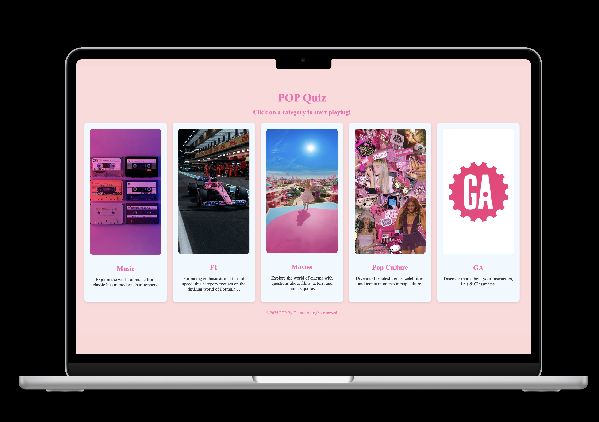

# POP! Quiz Game


**POP By Fatima** is a fun and interactive quiz game where users can test their knowledge in five exciting categories:
- Music  
- Formula 1  
- Movies  
- Pop Culture
- General Assembly

Each quiz includes multiple-choice questions to challenge what you know — from classic tunes to fast-paced F1 history, iconic films, celebrity trends and GA.

---

## Why i made this game

I created POP! during my time at General Assembly’s Software Engineering Bootcamp as a fun way to blend learning with creativity. I wanted to build something that felt lighthearted, nostalgic, and genuinely fun — a break from typical apps that still showcases solid front-end development skills.

---

## Deployed link

https://pop-by-fatima.surge.sh/

---

## Trello link

https://trello.com/invite/b/686e63caf1df01580217c5a5/ATTIa26d61458ab1e07f5db11d8b1cfa2e71A4C80252/pop

## Features

- Easy-to-use and beginner-friendly UI
- 5 fun quiz categories
- Multiple-choice questions
- Tracks your score
- Option to reset the quiz or return to the home screen
- Simple navigation with **Skip** and **PlayAgain** buttons

---

## How to Use

1. Choose a category from the home screen.
2. Answer each question by clicking one of the four answer buttons.
3. Click **Skip** to move to the next question.
4. View your final score at the end.
5. Click **PlayAgain** to retake the quiz or **Home** to select another category.

---

## Technologies Used

- HTML
- CSS
- JavaScript

---

## Resources Used

- mdn web docs
- W3schools

---

## Next Steps

- Adding a progress bar 
- Randomizing question order after each round

---

## Project Structure

```plaintext
/POP-BY-FATIMA
│
├── index.html               # Main home page with category selection
├── playf1.html              # F1 quiz page
├── playga.html              # General Assembly quiz page
├── playmovies.html          # Movies quiz page
├── playmusic.html           # Music quiz page
├── playpopculture.html      # Pop Culture quiz page
│
├── style.css                # All styling and layout
│
├── app.js                   # Logic for F1 quiz
├── app ga.js                # Logic for General Assembly quiz
├── app movies.js            # Logic for Movies quiz
├── app music.js             # Logic for Music quiz
├── app pop.js               # Logic for Pop Culture quiz
│
├── README.md                # Project overview and instructions
├── pseudocode.md            # Pseudocode explanation of game flow
├── CNAME                    # Custom domain file 
│
├── /images                  # Image assets used across the project
│   ├── alpine-pink.JPG
│   ├── barbie-pink.jpg
│   ├── ga-pink.jpg
│   ├── icons-pink.jpg
│   ├── music-pink.jpg
│   └── Prototype.png
│
└── /sound                   # Background music
    └── flash-quiz-loop.mp3
